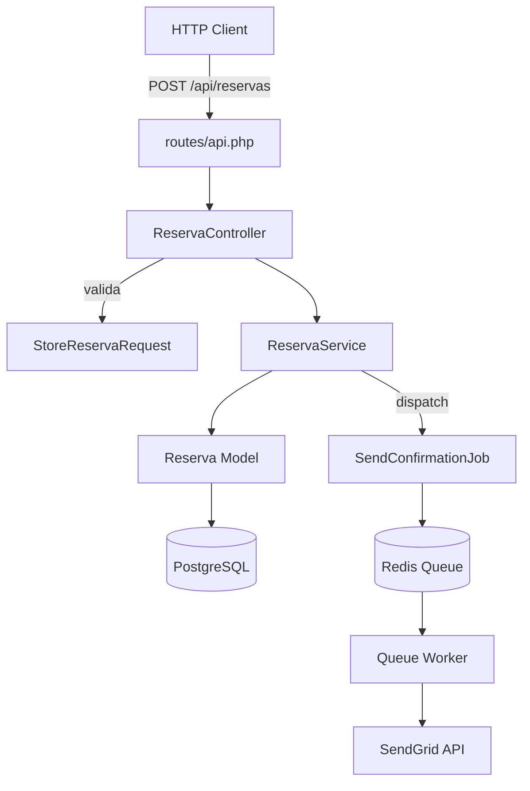

# `/map-service` — Diagrama Mermaid de arquitectura (multi-stack)

## Cuándo usarla

- **Brownfield-refactor**: entender la arquitectura interna del módulo a refactorizar
- **Modernización**: visualizar servicios legacy a reemplazar
- **Documentación**: generar diagrama para README o Confluence sobre código existente

## Flags

```bash
/map-service                          # Analiza el repo entero (cwd)
/map-service <modulo>                 # Foca en un módulo específico
/map-service <modulo> --save          # Guarda en .ai/diagrams/<modulo>.md
/map-service --depth=N                # Profundidad de capas (default 3)
```

## Proceso

### Paso 1 — Detectar stack

Leer `primary_language` y `framework` de `.ai/REPO-CONTEXT.md` si existe.
Si no, detectar con los mismos indicadores que `/init-repo-context`.

### Paso 2 — Identificar capas por stack

El diagrama debe usar los nombres de capa propios del framework. No imponer nomenclatura NestJS a un repo Laravel.

**Node / NestJS:**
```
Controller → Service → Repository → DB
              Service → EventEmitter → Message Bus
              Service → ExternalService → API externa
```

**Node / Express:**
```
Router → Handler → Service → Model → DB
```

**Node / Next.js:**
```
Page/Route → ServerAction/API → Service → DB
```

**PHP / Laravel:**
```
Route → Controller → Service / Action → Model (Eloquent) → DB
Route → Controller → FormRequest → Controller (validación)
Controller → Job → Queue → Worker
Controller → Event → Listener
```

**PHP / Symfony:**
```
Controller → Service → Repository → Entity (Doctrine) → DB
EventSubscriber ← Dispatcher
```

**Python / Django:**
```
URL → View → Form/Serializer → Model → DB
View → Service / Manager → Model
Signal → Receiver
```

**Python / FastAPI:**
```
Router → Endpoint → Service → Repository → DB
Depends → Dependency Injection
```

**Python / Flask:**
```
Blueprint → View → Service → Model → DB
```

**.NET / ASP.NET:**
```
Controller → Service/Handler → Repository → DbContext → DB
MediatR: Controller → Command/Query → Handler → Repository
```

**Java / Spring:**
```
Controller (@RestController) → Service (@Service) → Repository (@Repository) → DB
Component → EventListener
```

**Go:**
```
Handler (http) → Service → Repository → DB
Middleware → Handler
```

### Paso 3 — Analizar el módulo

Leer el código fuente y mapear:

1. **Capas presentes**: ¿Qué capas existen en el código real? (no todas las de arriba estarán)
2. **Flujo principal**: el camino feliz de una request típica
3. **Integraciones externas**: DB, cache, queue, APIs externas, storage
4. **Eventos**: mensajes que produce o consume
5. **Anomalías arquitectónicas**: código que rompe la capa esperada (acceso a DB desde controller, lógica de negocio en migration, etc.)

### Paso 4 — Generar diagrama Mermaid

Producir un `graph TD` (top-down) válido. Si el módulo tiene flujos horizontales prominentes, usar `graph LR`.

Convenciones:
- Nodos externos (DB, APIs, queue): usar `[( )]` para DB, `( )` para servicios
- Nodos del propio código: usar `[ ]`
- Anomalías detectadas: agregar nota `:::warning` si Mermaid lo soporta, o comentario

### Paso 5 — Párrafo explicativo

Después del bloque ```mermaid```, dar un párrafo en lenguaje de negocio explicando:
- Qué hace el servicio
- Cuáles son las capas principales y su rol
- Qué integraciones externas tiene y para qué

---

## Si existe `.ai/REPO-CONTEXT.md`

Leer sección §3 (Arquitectura interna) y §4 (Entry points) como input base.
No re-analizar desde cero — refinar el diagrama con esa data.

---

## Reglas

1. **Read-only**
2. **Mermaid válido** — el output debe ser parseable por mermaid-cli
3. **Una sola figura** — si el módulo es muy grande, sugerir dividir en sub-diagramas y emitir varios `/map-service <sub-modulo>`
4. **Nomenclatura del framework** — usar los nombres reales del stack, no imponer NestJS sobre Laravel o Django
5. **Honesto sobre anomalías** — si hay código que viola la arquitectura esperada, mencionarlo en el párrafo explicativo

---

## Output esperado — ejemplo Laravel



**Explicación:** El módulo de reservas expone un endpoint REST que pasa por validación de FormRequest antes de llegar al Controller. El Controller delega la lógica al ReservaService, que persiste via Eloquent y despacha un Job asíncrono para el envío de confirmación por email a través de SendGrid.
